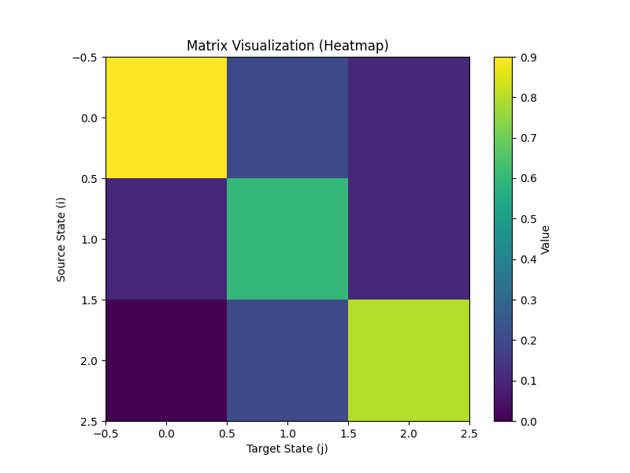
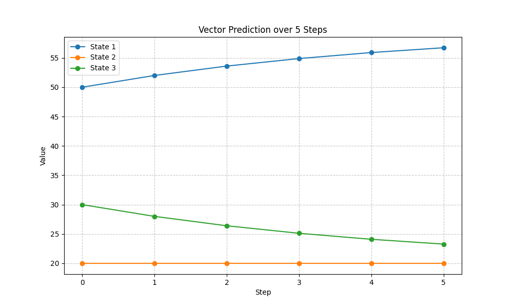

# Bioinformatics Assignments

This repository contains implementations for three assignments regarding Discrete Linear Dynamical Systems and Markov Chain Analysis.

## Dependencies

To run these scripts, you need Python 3 installed along with the following libraries:

    pip install numpy matplotlib

---

## Assignment 1: Matrix Prediction System

Predicts the state of a vector over 5 discrete steps using an arbitrary square matrix and visualizes the results.

### Execution
Run the following script:

    python ex1.py

### Outputs
The script creates a folder named `assignment_results` containing the following visualizations:

**1. Matrix Heatmap**


**2. Prediction Trajectory**


---

## Assignment 2: DNA Transition Analysis

Generates a random 50-letter DNA sequence and computes the transition probabilities between nucleotides (A, C, G, T).

### Execution
Run the following script:

    python ex2.py

### Outputs
* **Console:** Prints the generated sequence and the formatted probability matrix.
* **File:** Generates `dna_transitions.json` containing the transition matrix.

---

## Assignment 3: Text and Word Transitions

Analyzes an English text (approx. 300 characters), maps unique words to ASCII symbols, and computes transition probabilities between them.

### Execution
Run the following script:

    python ex3.py

### Outputs
* **Console:** Prints the input text, token count, and a sample of the symbol legend.
* **File:** Generates `word_transitions.json` containing:
    * `legend`: Mapping of ASCII symbols to English words.
    * `matrix`: The calculated transition probabilities between symbols.

---

## Assignment 4: Sequence Synthesis

Uses the transition matrices generated in Assignments 2 and 3 to synthesize new, random sequences of DNA and English text.

### Execution
Run the following script:

    python assignment4_synthesis.py

### Outputs
* **Console:** Prints previews of the 3 generated DNA sequences and 3 generated text sentences.
* **File:** Generates `synthesized_sequences.json` containing the full outputs.

#### Example Output (`synthesized_sequences.json`)
```json
{
    "DNA_Sequences": [
        "ATCCTCACCCTCTGGACGCTTTTCCTACTACTTCCCGCTACTTAGGACCC",
        "TCTACTTACCCGCCTATTTTACTGTTAGAATTTTGACGAATTGCTTTTTC",
        "CGGTGCACTATTGCACACTTATTAAGATGCCCGCCGGTCTTGCAGCAGCA"
    ],
    "Text_Sequences": [
        "tools for understanding biological data in particular when the biological data in particular when the data sets are large and",
        "when the biological data sets are large and interpret the biological data in particular when the biological data sets are",
        "interdisciplinary field of science information engineering mathematics and interpret the data sets are large and software tools for understanding biological"
    ]
}