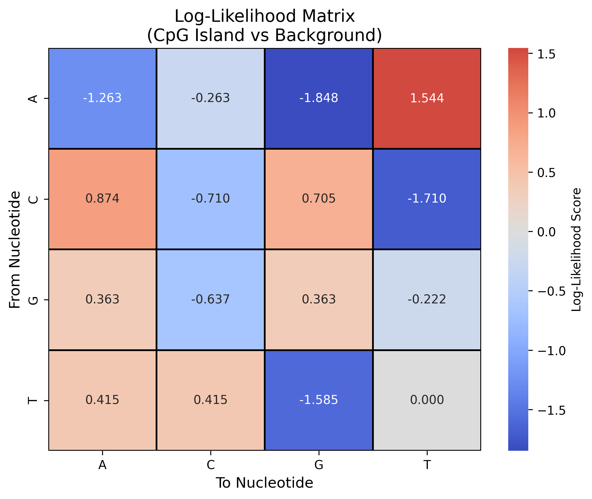
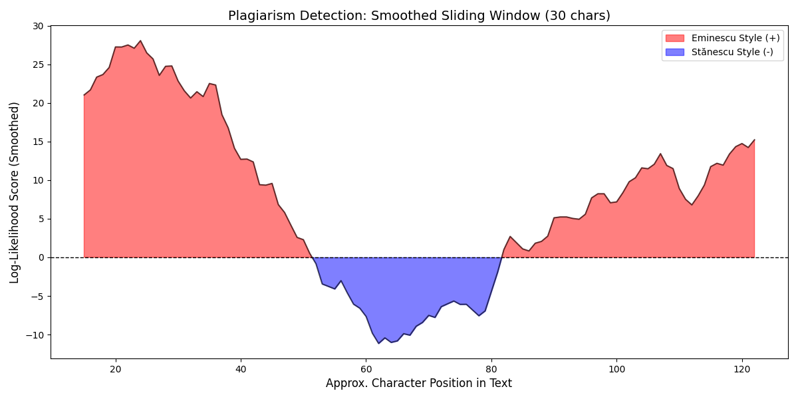
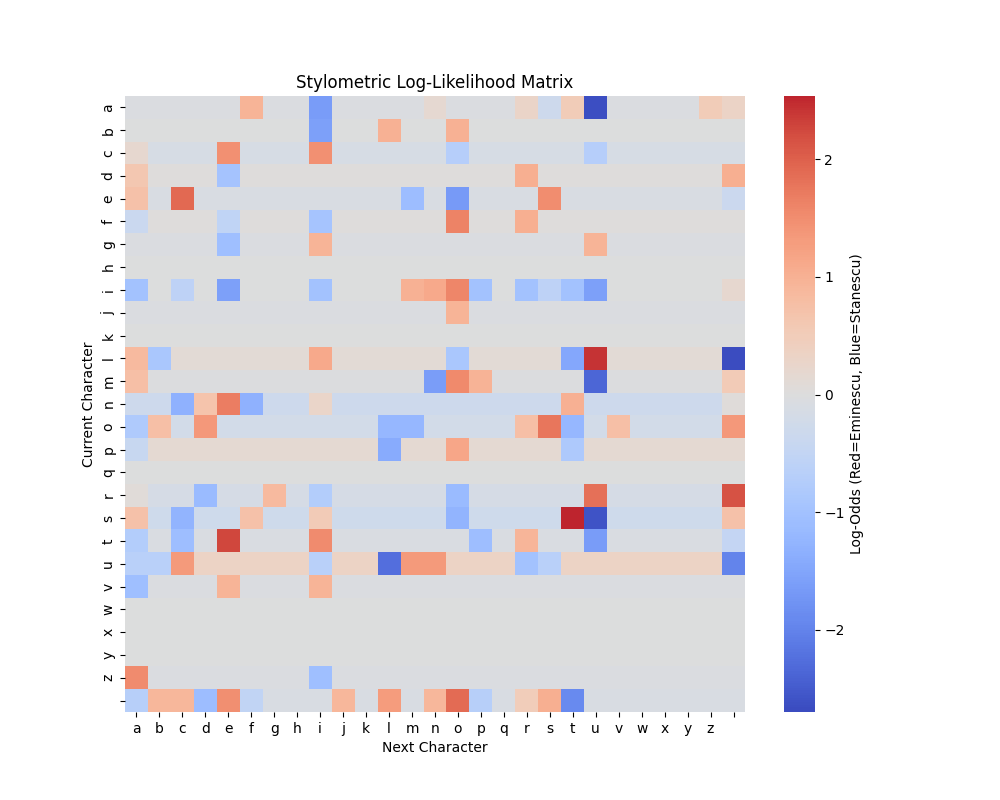

# Bioinformatics & Stylometry Analysis Portfolio

This repository contains solutions for two distinct problems using **Markov Chains** and **Log-Likelihood Scoring**. The first task applies these concepts to genomics (CpG Island detection), while the second applies them to computational linguistics (Authorship Attribution/Plagiarism Detection).

## Project Structure

### Task 1: CpG Island Detection (Bioinformatics)
**Goal:** To classify a DNA sequence as either a "CpG Island" (associated with active gene promoters) or a background genomic region.

**Methodology:**
1.  **Training:** Two Markov models were built using transition frequencies from known sequences:
    * **Model (+):** Trained on a known CpG Island sequence (`S1`).
    * **Model (-):** Trained on a known non-island sequence (`S2`).
2.  **Log-Odds Matrix:** A 4x4 matrix was constructed where each cell represents the log-ratio of observing a specific nucleotide transition (e.g., A → C) in an island versus a non-island. Laplace smoothing (+1) was applied to handle zero-frequency transitions.
3.  **Scoring:** A test sequence `S` ("CAGGTTGGAAACGTAA") was scored by summing the log-likelihood values of its transitions.

**Output Visualization:**
*Below is the Log-Likelihood Matrix heatmap. Red cells indicate transitions strongly associated with CpG Islands, while blue cells indicate background DNA.*



---

### Task 2: Plagiarism Detection & Stylometry (Computational Linguistics)
**Goal:** To determine if an "accused" text was written by Mihai Eminescu, Nichita Stănescu, or a combination of both (plagiarism).

**Methodology:**
1.  **Corpus Training:** Two distinct stylometric models were created based on character-to-character transition probabilities:
    * **Model A:** Trained on poetry by **Mihai Eminescu**.
    * **Model B:** Trained on poetry by **Nichita Stănescu**.
2.  **Log-Likelihood Matrix:** A 27x27 matrix (alphabet + space) was generated to capture the "signature" transitions of each author.
3.  **Sliding Window Analysis:** The accused text was scanned using a 30-character sliding window. The cumulative log-score of each window determines the likely author for that segment.

**Output Visualizations:**

*1. Plagiarism Analysis Graph*
*The graph below shows the authorship probability over the text. Red zones (>0) indicate Eminescu's style, while blue zones (<0) indicate Stănescu's style.*



*2. Stylometry Matrix*
*A heatmap of the character transition probabilities used to differentiate the authors.*



---

## How to Run

Ensure you have Python installed along with the required libraries:

```bash
pip install pandas matplotlib seaborn numpy